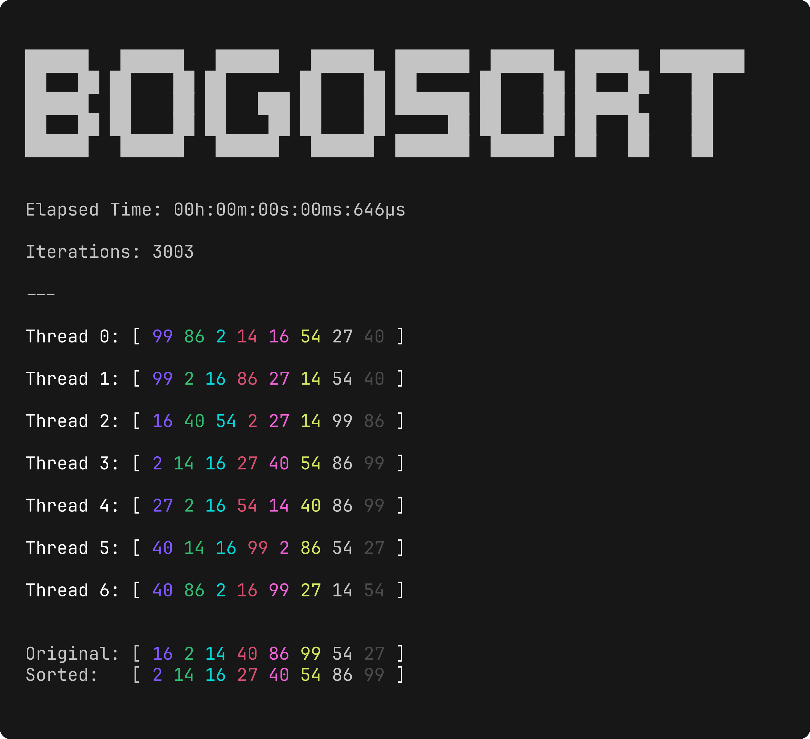

# bogosort
This repository contains a visualized and multithreaded implementation of the [Bogosort](https://en.wikipedia.org/wiki/Bogosort) algorithm in C#.

### Description
The Bogosort algorithm operates by repeatedly shuffling the elements of an array until they are in sorted order.

### Procedure
1. Check if the array is sorted, terminate if so.
2. If the array is not sorted, randomly permute its elements.
3. Return to the first step and repeat until the array is sorted.

### Performance
| Average   | Best  | Worst    | Space |
|-----------|------|---------|-------|
| Ø(n*n!)   | Ω(n) | unbounded | O(1) |

### Preview

  

### License
This project is licensed under the [GNU General Public License v3.0](LICENSE) (GPLv3).
